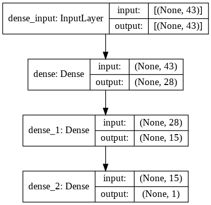

# Neural Network Charity Analysis
## Overview of the analysis: Explain the purpose of this analysis.
Alphabet Soup is an organization dedicated in helping organizations that take care of the enviroment, improve people wellbeing and unify the world, they have invested over 10 Billion dollars in the past years, in order to analyze the impact of their donations, they want us to analyze which organizations are worth donation to and which ones are of high risk.

From Alphabet Soup’s business team, we have received a CSV containing more than 34,000 organizations that have received funding from Alphabet Soup over the years. Within this dataset are a number of columns that capture metadata about each organization, such as the following:
* **EIN** and **NAME**—Identification columns
* **APPLICATION_TYPE**—Alphabet Soup application type
* **AFFILIATION—Affiliated** sector of industry
* **CLASSIFICATION**—Government organization classification
* **USE_CASE**—Use case for funding
* **ORGANIZATION**—Organization type
* **STATUS**—Active status
* **INCOME_AMT**—Income classification
* **SPECIAL_CONSIDERATIONS**—Special consideration for application
* **ASK_AMT**—Funding amount requested
* **IS_SUCCESSFUL**—Was the money used effectively

## Resources:
* Data Source: <code>charity_data.csv</code>
* Software: <code>Python 3.9</code>, <code>Jupyter Notebook 6.1.4</code>, <code>Tensorflow 2.6.0</code> and <code>Pandas</code>
## Results: 

### Data Preprocessing
From the variables we have, we defined the variable <code>IS_SUCCESSFUL</code> as the target of our model, then the next steps were followed:
* The following variable(s) were removed from input and data: <code>NAME</code> and <code>EIN</code>
* Categorical variables with a number of unique values higher than then were bucketed as follows:
  * <code>APPLICATION_TYPE</code> with less than <code>200</code> value counts were grouped into a new category **Other** reducing the number of unique values from **17** to <code>9</code>
  * <code>CLASSIFICATION</code> with less than <code>1000</code> value counts were grouped into the category **Other** reducing the number of unique values from **71** to <code>6</code>
* Encode all categorical variables with <code>OneHotEncoder</code>
* Merge the one-hot encoded DataFrame with the original DataFrame and drop the original categorical variables.
* Drop our target variable <code>IS_SUCCESSFUL</code> and mantain the remaining as features.
* Split the data into training <code>75%</code> and testing <code>25%</code> sets with the sklearn function <code>train_test_split</code>
* Scale the data with the sklearn function <code>StandardScaler()</code>

### Compiling, Training, and Evaluating the Model
Using tensorflow and keras we defined a Neural Network model with two Dense layers of <code>28</code> hidden nodes and <code>15</code> hidden nodes respectively, using the activation function relu and an Output layer with the sigmoid activation layer as shown in the image below: 

  

With this model, we obtained ana accuracy of <code>72.43%</code> and it's performance is shown in the confusion matrix below: 

  

How many neurons, layers, and activation functions did you select for your neural network model, and why?
Were you able to achieve the target model performance?
What steps did you take to try and increase model performance?
## Summary: Summarize the overall results of the deep learning model. Include a recommendation for how a different model could solve this classification problem, and explain your recommendation.
